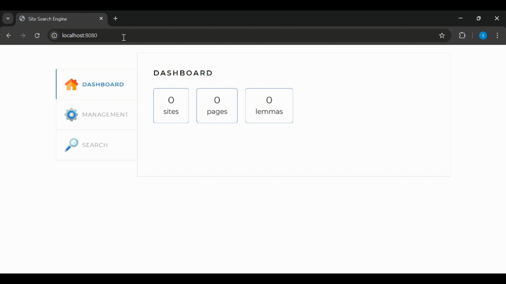
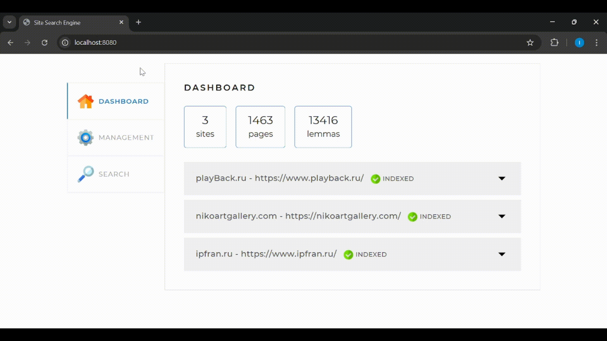

# Search Engine
## Desctiption
The search engine is implemented as a **Spring application**, working with a **locally installed database**. It has a simple web interface and an API through which it can be managed. 
API allows to:
- start/stop indexation of the website
- index pages of the websites
- search content on the pages
- get statistics about work of application (how many pages and lemmas found etc.)
## Working with app through web interface
Press START INDEXING to find all the pages of the website and all lemmas that occur on the pages.

Enter path of the page that you would like to reindex and press ADD/UPDATE to reindex specified page. If there are few pages with such path, they will be all reindexed in different threads.

Enter your query and press SEARCH, to find pages that contains information you need.

## Principles of a Search Engine
1. The configuration file specifies the addresses of the websites the engine will search through.
2. The search engine independently crawl all pages of the specified websites and index them so that it can later find the most relevant pages for any search query.
3. The user sends a query via the engine’s API. The query is a set of words for which the website’s pages should be found.
4. The query is transformed in a certain way into a list of words converted to their base form (lemmas). For example, for nouns — nominative case, singular.
5. The index is searched for pages containing all these words.
6. The search results are ranked, sorted, and returned to the user.
7. Note that for now it only finds russian lemmas on pages, which means that search can be only done in russian.
